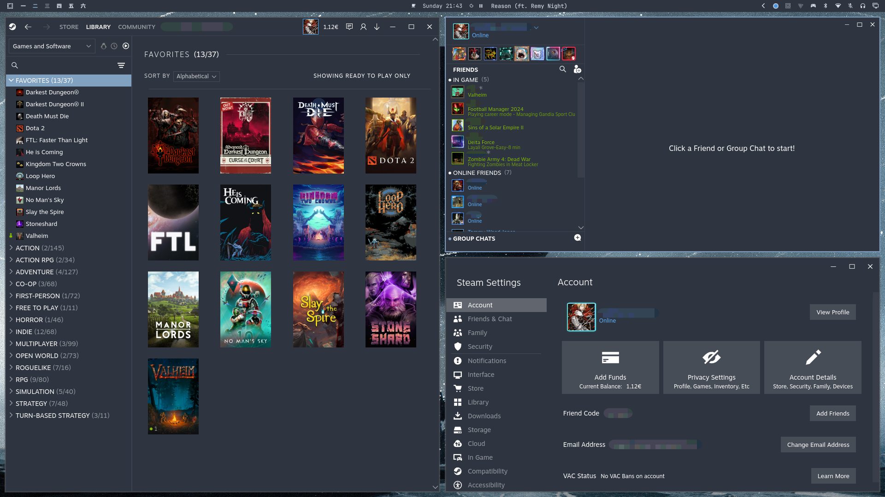
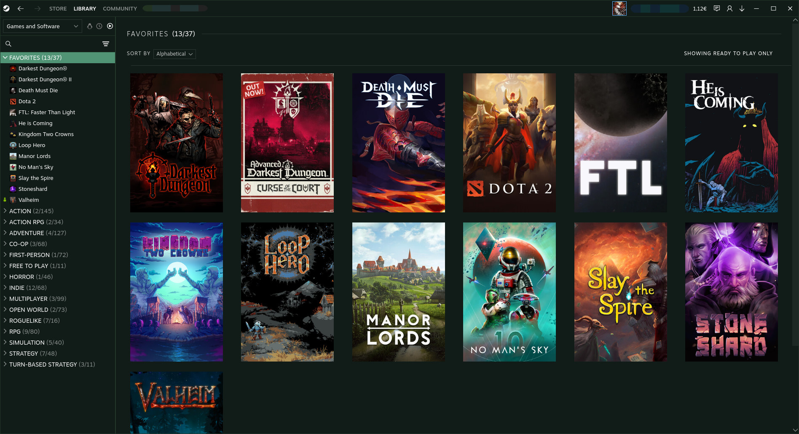
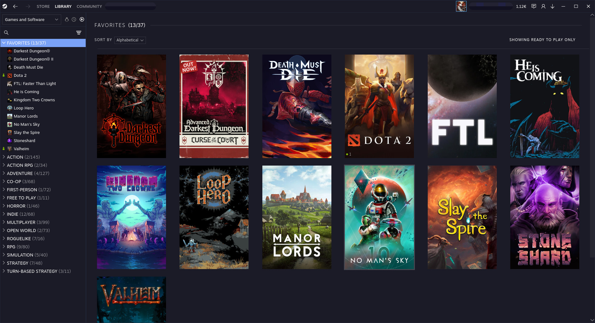
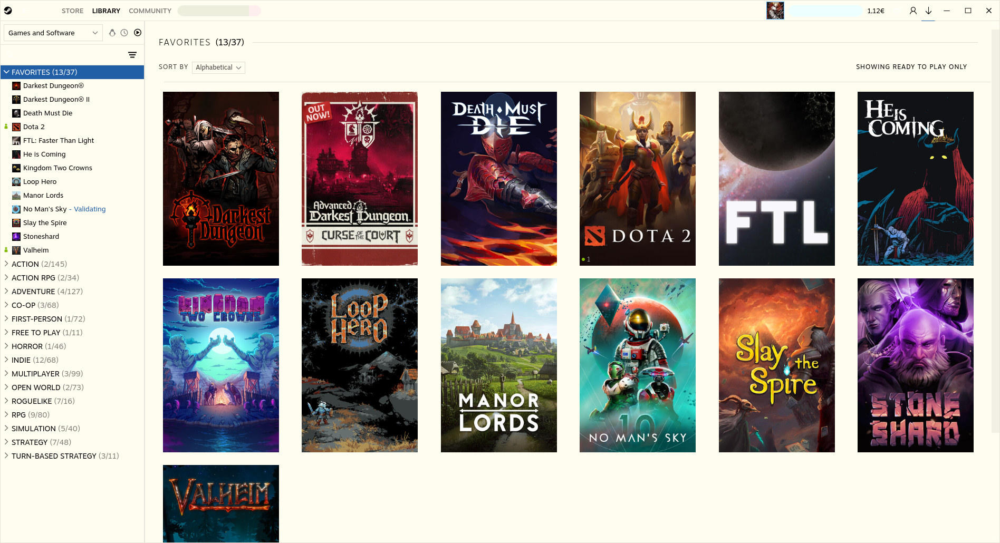

# OmaSteam



[Metro by Rose](https://github.com/RoseTheFlower/MetroSteam) for Steam, plus an [Omarchy](https://omarchy.org/) `theme-set` hook that writes `custom.css` from the active `colors.toml`.

You do **not** install Metro by Rose separately. This repo is the skin and the hook.

## Dependencies

OmaSteam does not install these for you.

### Steam

A **native** Steam client. Millennium [does not support](https://docs.steambrew.app/users/getting-started/installation) Steam from Flatpak or Snap.

- Arch / Omarchy: `sudo pacman -S steam`
- Other distros: use your package manager, not the Flatpak
- Windows: install Steam from [store.steampowered.com](https://store.steampowered.com/about/)

Launch Steam once and finish login before installing Millennium.

### Millennium

[Millennium](https://steambrew.app/) is the Steam theme loader. Without it, OmaSteam cannot inject.

- Arch / Omarchy: `yay -S millennium-bin`
- Other Linux: `curl -fsSL "https://steambrew.app/install.sh" | bash`
- Windows: the installer from the [Millennium installation guide](https://docs.steambrew.app/users/getting-started/installation)

Then start Steam. Millennium should appear under **Steam → Millennium**. That also creates `~/.steam/steam/millennium/themes/` (Linux) so `install.sh` has somewhere to copy the skin.

### Omarchy

Needed for the palette hook (`omarchy theme set` → `colors.toml`). The Metro skin still works on a machine without Omarchy; you just will not get automatic color sync.

- Install Omarchy from [omarchy.org](https://omarchy.org/)

## Install

```bash
git clone https://github.com/tempest-chaoscreator/OmaSteam.git ~/src/OmaSteam
~/src/OmaSteam/install.sh --yes
```

`install.sh` copies the skin into `~/.steam/steam/millennium/themes/OmaSteam`, symlinks the hook into `~/.config/omarchy/hooks/theme-set.d/`, writes `custom.css` from the current Omarchy theme, and tells Millennium to use OmaSteam.

If Steam is open, that last step is a GUI-only reload (`SteamClient.Browser.RestartJSContext`) — the same action as Millennium's **Restart Now**. Downloads and games stay up; Friends List may close.

## After that

`omarchy theme set` updates Steam colors. Leave OmaSteam's **Variation** on Standard so the hook owns the palette. Extra Metro options (decals, friends, web pages) still work in Millennium → Themes → OmaSteam.

## Examples

The same library under four Omarchy palettes:

**Osaka Jade**



**Retro 82**


**Tokyo Night**



**Flexoki Light**



## Uninstall

```bash
~/src/OmaSteam/uninstall.sh          # remove the theme-set hook
~/src/OmaSteam/uninstall.sh --purge  # also delete the installed theme files
```

Then pick another theme in Steam → Millennium → Themes if you want the stock look.

## Credits

Skin by [Rose](https://github.com/RoseTheFlower/MetroSteam). See `UPSTREAM.md` and `NOTICE`.
